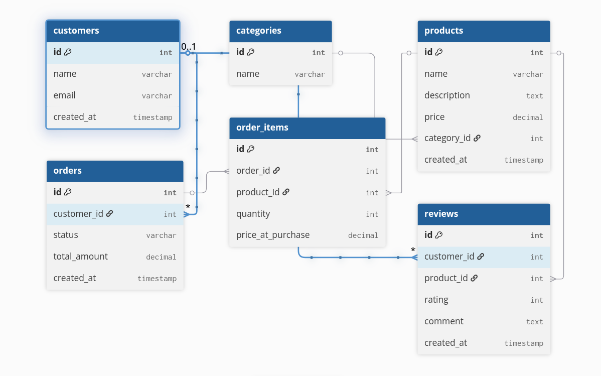

# E-Commerce Database

A relational database project modelling a real-world e-commerce system, built with **PostgreSQL**. Includes table definitions, indexes, a large fake-data generator, and a set of analytical SQL queries. A lightweight **Django** ORM layer is also provided for reference.

---

## Database Design



---

## Tables

### `customers`
Stores registered customers.

| Column | Type | Notes |
|---|---|---|
| `id` | SERIAL | Primary key |
| `name` | VARCHAR(100) | Required |
| `email` | VARCHAR(255) | Unique, required |
| `created_at` | TIMESTAMP | Auto-set on insert |

---

### `categories`
Product categories (e.g. Electronics, Clothing, Books).

| Column | Type | Notes |
|---|---|---|
| `id` | SERIAL | Primary key |
| `name` | VARCHAR(100) | Unique, required |

---

### `products`
Items available for purchase. Each product belongs to one category.

| Column | Type | Notes |
|---|---|---|
| `id` | SERIAL | Primary key |
| `name` | VARCHAR(200) | Required |
| `description` | TEXT | Optional |
| `price` | DECIMAL(10,2) | Must be ≥ 0 |
| `category_id` | INT | FK → `categories.id` (RESTRICT on delete) |
| `created_at` | TIMESTAMP | Auto-set on insert |

---

### `orders`
A purchase transaction made by a customer.

| Column | Type | Notes |
|---|---|---|
| `id` | SERIAL | Primary key |
| `customer_id` | INT | FK → `customers.id` (CASCADE on delete) |
| `status` | VARCHAR(50) | `pending` / `completed` / `cancelled` |
| `total_amount` | DECIMAL(10,2) | Must be ≥ 0 |
| `created_at` | TIMESTAMP | Auto-set on insert |

---

### `order_items`
Line items within an order (one row per product per order).

| Column | Type | Notes |
|---|---|---|
| `id` | SERIAL | Primary key |
| `order_id` | INT | FK → `orders.id` (CASCADE on delete) |
| `product_id` | INT | FK → `products.id` (RESTRICT on delete) |
| `quantity` | INT | Must be > 0 |
| `price_at_purchase` | DECIMAL(10,2) | Snapshot of price at time of order |

---

### `reviews`
Customer review for a product. Each customer can review a product only once.

| Column | Type | Notes |
|---|---|---|
| `id` | SERIAL | Primary key |
| `customer_id` | INT | FK → `customers.id` (CASCADE on delete) |
| `product_id` | INT | FK → `products.id` (CASCADE on delete) |
| `rating` | INT | 1 – 5 |
| `comment` | TEXT | Optional |
| `created_at` | TIMESTAMP | Auto-set on insert |
| — | UNIQUE | `(customer_id, product_id)` |

---

## Relationships

```
customers  ──< orders ──< order_items >── products >── categories
customers  ──< reviews >── products
```

- A **customer** can place many **orders**.
- An **order** contains many **order_items**, each referencing a **product**.
- A **product** belongs to exactly one **category**.
- A **customer** can write at most one **review** per **product**.

---

## Indexes

| Index | Table | Column(s) | Purpose |
|---|---|---|---|
| `idx_products_category` | `products` | `category_id` | Speed up category filter / join |
| `idx_orders_customer` | `orders` | `customer_id` | Speed up orders-by-customer lookup |
| `idx_order_items_order` | `order_items` | `order_id` | Speed up fetching items for an order |
| `idx_order_items_product` | `order_items` | `product_id` | Speed up product sales queries |
| `idx_reviews_product` | `reviews` | `product_id` | Speed up product review aggregation |

---

## Project Structure

```
.
├── docker-compose.yaml      # PostgreSQL 16 + pgAdmin 4 services
├── table_creation           # Raw SQL to create all tables and indexes
├── e_commerce_queries       # 10 analytical SQL queries with explanations
├── data_generator.py        # Faker-based script to seed the database
└── ecommerce/               # Django project with ORM models mirroring the schema
    └── database/
        └── models.py
```

---

## Getting Started

### 1. Start the database

```bash
docker compose up -d
```

| Service | URL |
|---|---|
| PostgreSQL | `localhost:5432` |
| pgAdmin | `http://localhost:5050` |

> **pgAdmin credentials:** `admin@gmail.com` / `admin`

### 2. Create the schema

Connect to the `ecommerce` database with any SQL client and run the contents of [`table_creation`](table_creation).

```bash
psql -h localhost -U admin -d ecommerce -f table_creation
```

### 3. Seed test data

Install dependencies and run the data generator to populate the database with realistic fake data:

```bash
pip install psycopg2-binary faker
python data_generator.py
```

This inserts:

| Table | Rows |
|---|---|
| categories | 5 |
| customers | 10,000 |
| products | 20,000 |
| orders | 50,000 |
| order_items | 100,000 |
| reviews | up to 30,000 |

---

## Analytical Queries

The [`e_commerce_queries`](e_commerce_queries) file contains 10 queries that demonstrate aggregations, CTEs, subqueries, and window functions:

| # | Question |
|---|---|
| 1 | Top 3 customers by total spending |
| 2 | Customers who placed more than 3 orders |
| 3 | Products that have never been ordered |
| 4 | Customers whose spending exceeds the average |
| 5 | Top 2 products per category by revenue |
| 6 | Running cumulative revenue by date |
| 7 | Second highest revenue product per category |
| 8 | Customers who bought from every category |
| 9 | 3 most recent orders per customer |
| 10 | Products with above-average revenue |

---

## Tech Stack

- **PostgreSQL 16** — primary database
- **Docker / Docker Compose** — local environment
- **pgAdmin 4** — GUI database management
- **Python / psycopg2 / Faker** — data generation
- **Django** — ORM layer for programmatic access
